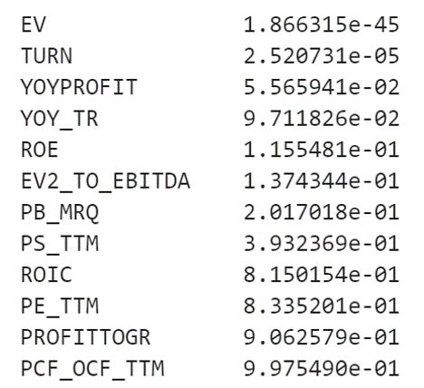
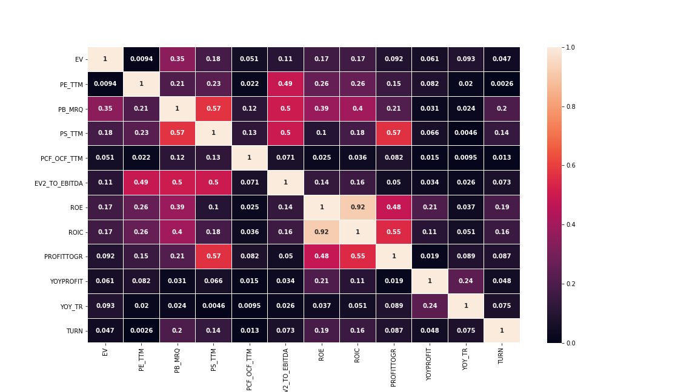
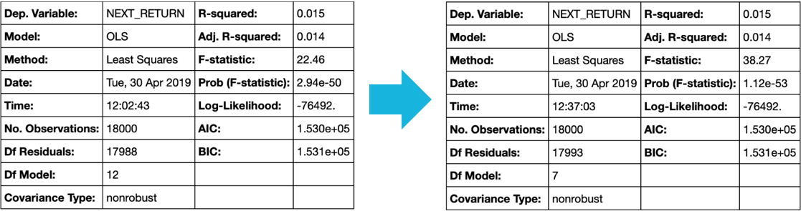
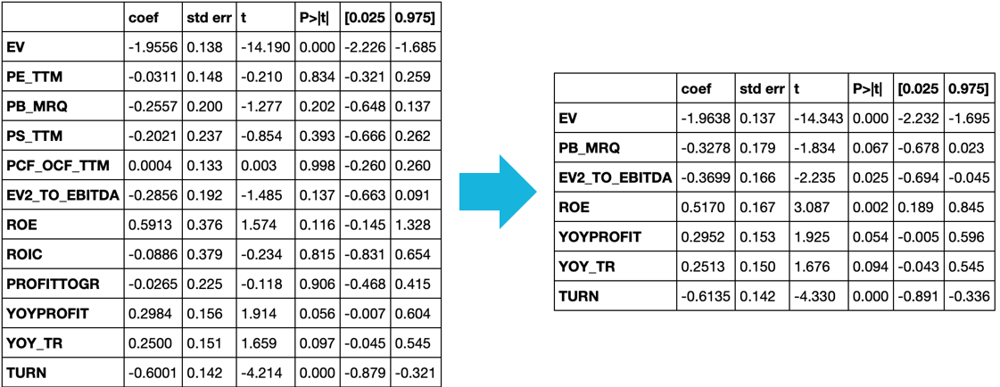
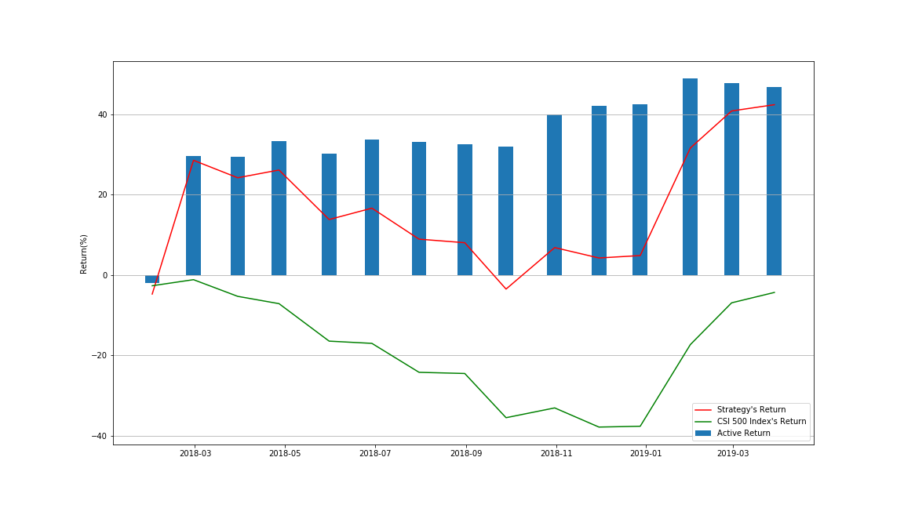
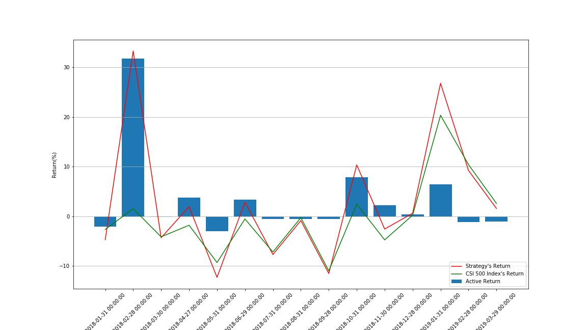

# Final Project: Enhanced Indexing Strategy with Multi-Factor Model

Group: 4

Members: Jiahua Jiang, Bo Sun, Baowen Cao

Date: 2019/04/30

## Project Introduction

In this project, we built up an Enhanced Indexing Strategy of China Securities Index (CSI) 500 on the basis of Arbitrage Pricing Theory (APT), by applying the Multi-Factor Model with regression method to predict the expected return of CSI 500 constituent stocks and determining the active weights in accord with our prediction.

## Dataset

The stock price and financial data were retrieved from Chinese information server Wind and Tushare.

## Workflow

* Collect and Preprocess Data
    - Get current CSI 500 constituent stocks and weights from Wind (csi_500_constituent_info.gz)
    - Get monthly price and factor information of 500 constituent stocks from 2015-01-01 to 2019-04-26 (csi_500_data_raw.gz)
        - Size
            - Market Capitalization: "EV"
        - Value    
            - Trailing Twelve Months P/E Ratio: "PE_TTM"
            - Most Resent Quarter P/B Ratio: "PB_MRQ"
            - Trailing Twelve Months P/S Ratio: "PS_TTM"
            - Trailing Twelve Months P/CF(Operating Cash Flow) Ratio: "PCF_OCF_TTM"
            - EV/EBITDA Ratio: "EV2_TO_EBITDA"
        - Profitability
            - Return on Equity: "ROE"
            - Return on Invested Capital: "ROIC"
            - Net Profit Margin: "PROFITTOGR"
        - Growth
            - Year-over-Year Net Income Growth Rate: "YOYPROFIT"
            - Year-over-Year Revenue Growth Rate: "YOY_TR"
        - Trading
            - Turnover Rate: "TURN"
    - Preprocess data (csi_500_data_preprocessed.gz)
        - Fill nans with data of the nearest month
        - Check if there're any nans left and locate them
            - EV/EBITDA and ROIC of 10 companies in banking and non-bank financial industries are missing
        - Fill nans remaining with industry's average
* Preprocess Factors
    - Calculate next month's return as dependent variable for future regression
    - Winsorize, standardize and neutralize factor values (factor_data.gz)
        - Winsorize: Trim the outliers at the tail (2.5 percentile) to avoid anomalies
        - Standardize: Convert factor values into z-scores to eliminate discrepancies in number scale
        - Neutralize: Eliminate the impact of industrial betas to avoid concentration of our stock selection model, by extracting residual in multiple linear regression between factor value and dummy variables of industries
* Factor Modeling and Strategy Construction
    - Separate the data into training and testing
        - Training data: 2015-01-01 to 2017-12-31
        - Testing Data: 2018-01-01 to 2019-04-26
    - Multiple linear regression (OLS) between next month's return and factor values
    - Improve the regression model
        - Sort the p-values to check the significance level of each factor's exposure (slope coefficient)
            - 
        - Plot a heatmap of the correlation matrix of factors to tell if there's multicollinearity
            - 
        - Remove redundant factors of high correlation with other factors and high p-values (low significance level)
            - Factor remaining: "EV", "PB_MRQ", "EV2_TO_EBITDA", "ROE", "YOYPROFIT", "YOY_TR", "TURN" 
        - Rerun multiple linear regression and compare the results
            - 
            - 
    - Build up an enhanced indexing strategy on the basis of model prediction
        - Clearing all positions and opening new positions at the end of each month
        - Using the multi-factor model to generate the score (prediction of expected return) of each constituent stock
        - Sort the constituent stocks by their scores and separate them into 10 groups
        - Set a multiplier for each group to put more weight on high-score stocks and vice versa
        - Clean up if there's still weight remaining
            - Evenly separated into 10 parts to buy top 10 stocks
        - Record the weighted return
* Backtesting
    - Get CSI 500 price information from Tushare
    - Check the active return: compare the return of the index and our enhanced indexing strategy
        - Cumulative Monthly Return
        
        - Noncumulative Monthly Return
        
    - Performance evaluation
        - Cumulative return of the testing period: 42.38%
        - Cumulative active return: 46.72%
        - Information ratio: 0.36
        
## Summary
* Benefits:
    - The enhanced indexing strategy outperforms the benchmark index to a considerable extent in 7 among 15 months, and has low drawbacks the month it performs worse than the benchmark
    - The model is meaningful on both statistical and economic aspects given the predictions are made on the basis of different catogories of factors
    - Since CSI 500 has a large sample size and the testing period is long, the multi-factor model tends to be more effective
    - Algorithmic model can be better than subjective judgment when dealing with stock selection in a large stock pool such as CSI 500
* Limitations:
    - The model ignores trading cost which will narrower the active return
    - The model ignores free-float market capitalization which may lead to problems in stock trading
    - The model ignores specific investment amount when using 1 as total weight, not taking liquidity need and market impact in consideration
    - The OLS method might not be optimal given it has a low r-squared and the process of removing redundant factors is subjective, though the slope coefficients are significant, using LASSO (Least Absolute Shrinkage and Selection Operator) instead might be better
    - The effectiveness of the model might be changing over time